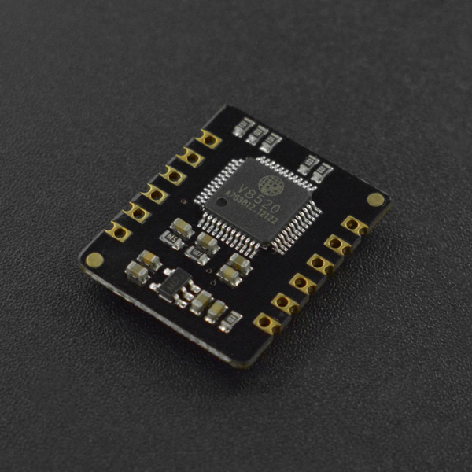

# DFRobot_BloodOxygen_S

- [英文版](./README.md)

DFRobot MAX30102 心率血氧传感器模块搭载了美信(maxim)的MAX30102心率血氧芯片和一颗集成心率血氧算法的微控制器，可以直接输出心率血氧数值。MAX30102采用PPG光电容积脉搏波描记法(PhotoPlethysmoGraphy)测量数据，微控制器对这些数据进行处理运算过后得到心率血氧数值，再通过I2C或UART接口输出，大大降低了传感器的使用难度和对主控的资源占用。同时该传感器还配备有对应的上位机，可通过电脑直接读取数据。



## 产品链接（[https://www.dfrobot.com.cn/goods-3392.html](https://www.dfrobot.com.cn/goods-3392.html)）

  SKU：SEN0344

## 目录

* [概述](#概述)
* [库安装](#库安装)
* [方法](#方法)
* [兼容性](#兼容性y)
* [历史](#历史)
* [创作者](#创作者)

## 概述

这个库提供了一个获取此时用户心率和血氧饱和度的例程

## 库安装

使用此库前，请首先下载库文件，将其粘贴到\Arduino\libraries目录中，然后打开examples文件夹并在该文件夹中运行演示。

## Methods
```C++
   /**
    * @struct sHeartbeatSPO2
    * @brief 存储心率和血氧饱和度的结构体
    */
   typedef struct
   {
     int SPO2;
     int Heartbeat;
   } sHeartbeatSPO2; 
   /**
    * @enum ebautrate
    * @brief 波特率枚举
    */
   typedef enum
   {
     BAUT_RATE_1200 = 0,
     BAUT_RATE_2400 = 1,
     BAUT_RATE_9600 = 3,
     BAUT_RATE_19200 = 5,
     BAUT_RATE_38400 = 6,
     BAUT_RATE_57600 = 7,
     BAUT_RATE_115200 = 8
   } ebautrate; 
   DFRobot_BloodOxygen_S(void){};
   ~DFRobot_BloodOxygen_S(void){}; 
   /**
    * @fn getHeartbeatSPO2
    * @brief 获取心率和血氧饱和度并存入到结构体sHeartbeatSPO2中
    */
   void getHeartbeatSPO2(void); 
   /**
    * @fn getTemperature_C
    * @brief 获取传感器板子的温度
    * @return 当前板载温度值（单位：摄氏度）
    */
   float getTemperature_C(void); 
   /**
    * @fn setBautrate
    * @brief 设置传感器的串口波特率
    * @param bautrate 波特率
    * @n  BAUT_RATE_1200 
    * @n  BAUT_RATE_2400 
    * @n  BAUT_RATE_9600 
    * @n  BAUT_RATE_19200 
    * @n  BAUT_RATE_38400 
    * @n  BAUT_RATE_57600 
    * @n  BAUT_RATE_115200 
    */
   void setBautrate(ebautrate bautrate); 
   /**
    * @fn getBautrate
    * @brief 获取串口波特率
    * @return 串口波特率
    */
   uint32_t getBautrate(void); 
   /**
    * @fn sensorStartCollect
    * @brief 传感器开始采集数据
    */
   void sensorStartCollect(void); 
   /**
    * @fn sensorEndCollect
    * @brief 传感器结束采集数据
    */
   void sensorEndCollect(void);

```
## 兼容性

MCU                | Work Well | Work Wrong | Untested  | Remarks
------------------ | :----------: | :----------: | :---------: | -----
Arduino Uno  |      √       |             |            | 
Leonardo  |      √       |             |            | 
Meag2560 |      √       |             |            | 
M0 |      √       |             |            | 
ESP32 |      √       |             |            | 
ESP8266 |      √       |             |            | 

## 历史

- 2019/12/13 - 1.0.0 版本

## Credits
Written by Pengkaixing(kaixing.peng@dfrobot.com), 2021. (Welcome to our [website](https://www.dfrobot.com/))