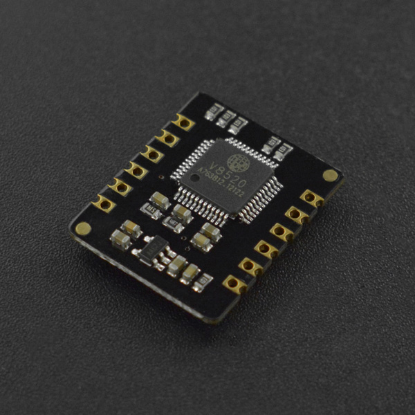

# DFRobot_BloodOxygen_S

- [英文版](./README.md)

DFRobot MAX30102 心率血氧传感器模块搭载了美信(maxim)的MAX30102心率血氧芯片和一颗集成心率血氧算法的微控制器，可以直接输出心率血氧数值。MAX30102采用PPG光电容积脉搏波描记法(PhotoPlethysmoGraphy)测量数据，微控制器对这些数据进行处理运算过后得到心率血氧数值，再通过I2C或UART接口输出，大大降低了传感器的使用难度和对主控的资源占用。同时该传感器还配备有对应的上位机，可通过电脑直接读取数据。



## 产品链接（[https://www.dfrobot.com.cn/goods-3392.html](https://www.dfrobot.com.cn/goods-3392.html)）

  SKU：SEN0344

## 目录

* [概述](#概述)
* [库安装](#库安装)
* [方法](#方法)
* [兼容性](#兼容性y)
* [历史](#历史)
* [创作者](#创作者)

## 概述

这个库提供了一个获取此时用户心率和血氧饱和度的例程

## 库安装

要使用这个库，首先将库下载到Raspberry Pi，然后打开例程文件夹。要执行一个例程gain_heartbeat_SPO2.py，请在命令行中输入python gain_heartbeat_SPO2.py。

## Methods

```python
   '''!
     @brief   开始函数，探测传感器是否正常连接
     @return  返回初始化状态
     @retval True 初始化成功
     @retval False 初始化失败
   '''
   def begin(self):

   '''!
     @brief   传感器开始采集数据
   '''
   def sensor_start_collect(self):

   '''!
     @brief   传感器结束采集数据
   '''
   def sensor_end_collect(self):

   '''!
     @brief   修改串口波特率
     @param bautrate
     @n     BAUT_RATE_1200 
     @n     BAUT_RATE_2400
     @n     BAUT_RATE_9600
     @n     BAUT_RATE_19200
     @n     BAUT_RATE_38400
     @n     BAUT_RATE_57600
     @n     BAUT_RATE_115200
   '''
   def set_bautrate(self,bautrate):

   '''!
     @brief 获取心率和血氧饱和度并存入到结构体sHeartbeatSPO2中
   '''
   def get_heartbeat_SPO2(self):

   '''!
     @brief   获取传感器的板子温度
     @return  返回板子温度
   '''
   def get_temperature_c(self):

   '''!
     @brief   获取传感器的串口波特率
     @return  返回传感器的串口波特率
   '''
   def get_bautrate(self):

```
## 兼容性

| 主板         | 通过 | 未通过 | 未测试 | 备注 |
| ------------ | :--: | :----: | :----: | :--: |
| RaspberryPi2 |      |        |   √    |      |
| RaspberryPi3 |      |        |   √    |      |
| RaspberryPi4 |  √   |        |        |      |

* Python 版本

| Python  | 通过 | 未通过 | 未测试 | 备注 |
| ------- | :--: | :----: | :----: | ---- |
| Python2 |  √   |        |        |      |
| Python3 |  √   |        |        |      |

## 历史

- 2019/12/13 - 1.0.0 版本

## Credits
Written by Pengkaixing(kaixing.peng@dfrobot.com), 2021. (Welcome to our [website](https://www.dfrobot.com/))